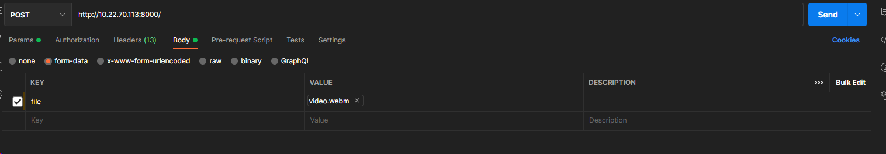

# Affective Input Framework

Docker and PM2 is required to run this project.

PM2 Installation Guide:
https://pm2.keymetrics.io/docs/usage/quick-start/

Docker Installation Guide:
https://www.docker.com/products/docker-desktop/

#### How to Run:

1. Pull and run docker image first, by running docker-compose up.
2. Run this command to start the services (might need to wait a bit for all the services to start):

   ```bash
   pm2 start ./ecosystem.config.js
   ```
3. To demo, run this command:

   ```bash
   cd client_service && npm run dev
   ```

#### Additional Info:

- The backend has two endpoints:
  - the root (/) receives a .webm format video, and only accepts POST requests. Make sure to use multipart/form-data, and upload the file when trying. Below is an example:

    
  - /text will receive accepts only POST requests, and requires a JSON body containing the key 'message'.
- Both endpoints has the same output format:
    ```bash
   {
      "message": "...",
      "emotion": "...",
      "speech_transcript": "..."
   }
      ```


#### References:

1. https://huggingface.co/SamLowe/roberta-base-go_emotions
